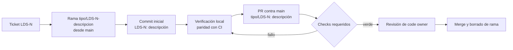

# Lobo Design System (LDS)

Librería de componentes React y fundamentos visuales (tokens, tema y estilos
base) de Lobo Films. Es la fuente única de verdad de la UI para las aplicaciones
web de la organización.

> **Estado:** `0.1.0`, en fase de fundación. El toolchain, la CI, el gobierno
> del repositorio y las convenciones de contribución ya están definidos. Todavía
> no hay componentes publicables ni pipeline de release (ver
> [Estado actual](#estado-actual-y-pendientes-conocidos)).

---

## Contenido

- [Descripción y alcance](#descripción-y-alcance)
- [Stack técnico](#stack-técnico)
- [Requisitos](#requisitos)
- [Inicio rápido](#inicio-rápido)
- [Scripts](#scripts)
- [Estructura del repositorio](#estructura-del-repositorio)
- [Flujo de ramas y Pull Requests](#flujo-de-ramas-y-pull-requests)
- [Integración continua](#integración-continua)
- [Decisiones de arquitectura (ADR)](#decisiones-de-arquitectura-adr)
- [Estado actual y pendientes conocidos](#estado-actual-y-pendientes-conocidos)
- [Gobierno y contacto](#gobierno-y-contacto)
- [Licencia](#licencia)

---

## Descripción y alcance

LDS es un **paquete de componentes puro**: no incluye capa de aplicación y lo
consumen como dependencia los proyectos de Lobo Films
([ADR 0004](docs/adr/0004-project-structure.md)).

### Dentro del alcance

- **Componentes React** organizados en tres capas:
  - `base`: primitivas visuales sin composición interna ni estado propio.
  - `composed`: composición de primitivas y/o estado propio.
  - `layouts`: primitivas de estructura y espaciado.
- **Fundamentos visuales en SCSS:** design tokens (color, spacing, tipografía,
  breakpoints), abstracts, tema y estilos base.
- **Documentación viva** en Storybook: autodocs por componente y MDX para
  documentación conceptual.
- **Verificación automatizada:** tests unitarios (jsdom), story tests en
  navegador real (Chromium) y auditoría de accesibilidad (`addon-a11y`).

### Fuera del alcance

- Routing, estado global de negocio, data fetching, servicios o integración con
  APIs.
- Estilos o variantes específicos de un único producto consumidor.
- Valores de diseño que no provengan de la fuente de diseño oficial
  (`Design System v2.0 Lobo`). No se inventan valores.

### Principios técnicos

| Principio                   | Implicación                                                                                                      |
| --------------------------- | ---------------------------------------------------------------------------------------------------------------- |
| API pública explícita       | Solo lo que exporta `src/ui/index.ts` forma parte del contrato. `ui/shared/` es infraestructura interna.         |
| Colocalización              | Implementación, estilos, stories y tests viven junto al componente.                                              |
| Scoping por convención      | SCSS con BEM y prefijo obligatorio `lds-` (`.lds-button`). No hay aislamiento automático de clases.              |
| Accesibilidad verificable   | Queries por rol y nombre accesible en tests; `addon-a11y` en cada story.                                         |
| Toolchain acoplado y fijado | Vite, Storybook, Vitest, Playwright, `plugin-react` y Oxlint solo reciben parches; los minors se evalúan a mano. |
| Paridad local–CI            | CI ejecuta los mismos scripts de `package.json`. Lo que pasa en local debe pasar en CI.                          |

---

## Stack técnico

| Área                     | Herramienta                                                                     | Versión                        | Referencia                                                                          |
| ------------------------ | ------------------------------------------------------------------------------- | ------------------------------ | ----------------------------------------------------------------------------------- |
| Runtime                  | Node.js                                                                         | `24` (`.nvmrc`)                | [ADR 0001](docs/adr/0001-stack-versions.md)                                         |
| Gestor de paquetes       | pnpm (vía Corepack)                                                             | `12.4.1` (`packageManager`)    | [ADR 0009 §2](docs/adr/0009-continuous-integration.md)                              |
| UI                       | React                                                                           | `^19.2`                        | —                                                                                   |
| Compilación de React     | React Compiler (`babel-plugin-react-compiler` vía `@rolldown/plugin-babel`)     | `1.x`                          | [ADR 0001 §5](docs/adr/0001-stack-versions.md)                                      |
| Lenguaje                 | TypeScript (`strict`, `exactOptionalPropertyTypes`, `noUncheckedIndexedAccess`) | `~6.0`                         | —                                                                                   |
| Build                    | Vite (Rolldown) + `@vitejs/plugin-react`                                        | `~8.3` / `~6.1`                | [ADR 0001](docs/adr/0001-stack-versions.md)                                         |
| Estilos                  | Sass (SCSS + BEM)                                                               | `^1.104`                       | [ADR 0004](docs/adr/0004-project-structure.md)                                      |
| Workshop y documentación | Storybook (`react-vite`, addons docs, a11y, vitest, mcp)                        | `~10.6`                        | [ADR 0007](docs/adr/0007-storybook.md)                                              |
| Testing                  | Vitest (jsdom + browser mode con Playwright/Chromium)                           | `~4.1` (no 5, deliberadamente) | [ADR 0001 §3](docs/adr/0001-stack-versions.md), [ADR 0008](docs/adr/0008-vitest.md) |
| Linting                  | Oxlint                                                                          | `~1.82`                        | [ADR 0006](docs/adr/0006-oxlint.md)                                                 |
| Formato                  | Prettier                                                                        | `^3.9`                         | [ADR 0005](docs/adr/0005-prettier.md)                                               |
| CI                       | GitHub Actions (`ubuntu-latest`)                                                | —                              | [ADR 0009](docs/adr/0009-continuous-integration.md)                                 |
| Dependencias             | Dependabot (`npm` + `github-actions`, semanal)                                  | —                              | [ADR 0003](docs/adr/0003-security-baseline.md)                                      |

> **Política de versiones.** Los paquetes del toolchain acoplado usan rangos `~`
> (solo parches) y Dependabot ignora sus minors y majors. Para subir un minor se
> necesita un PR `arch/` dedicado y actualizar ADR 0001 y ADR 0003.

---

## Requisitos

| Requisito                       | Detalle                                                                                |
| ------------------------------- | -------------------------------------------------------------------------------------- |
| Node.js 24                      | Versión fijada en `.nvmrc` y usada por CI. Se recomienda nvm, fnm o Volta.             |
| Corepack                        | Activa la versión de pnpm declarada en `packageManager`. No instales pnpm globalmente. |
| Chromium de Playwright          | Lo necesita el proyecto `storybook` de Vitest (`pnpm test`).                           |
| Acceso a `lobo-films` en GitHub | El repositorio es privado. Se clona por SSH.                                           |
| Acceso a Jira (proyecto `LDS`)  | Toda rama, commit inicial y PR se asocia a un ticket.                                  |

La lista completa, con comandos de verificación, está en
[Getting started §1](docs/GETTING_STARTED.md#1-requisitos).

---

## Inicio rápido

```bash
git clone git@github.com:lobo-films/lobo-design-system.git
cd lobo-design-system

nvm use                                  # Node según .nvmrc
corepack enable                          # pnpm según packageManager
pnpm install --frozen-lockfile
pnpm exec playwright install chromium    # requerido por pnpm test

pnpm storybook                           # http://localhost:6006
```

La guía paso a paso, que cubre el editor, la verificación de la instalación, el
primer PR y la solución de problemas, está en
**[docs/GETTING_STARTED.md](docs/GETTING_STARTED.md)**.

---

## Scripts

| Script            | Comando                                              | Propósito                                                                                                                                         | Check en CI                   |
| ----------------- | ---------------------------------------------------- | ------------------------------------------------------------------------------------------------------------------------------------------------- | ----------------------------- |
| `storybook`       | `storybook dev -p 6006`                              | Entorno principal de desarrollo: workshop, autodocs, panel de a11y, tests por story y endpoint MCP.                                               | —                             |
| `build-storybook` | `storybook build`                                    | Build estático en `storybook-static/`.                                                                                                            | — (pendiente como smoke test) |
| `dev`             | `vite`                                               | Playground local (`index.html` → `src/main.tsx`) con HMR. No forma parte de la API pública.                                                       | —                             |
| `typecheck`       | `tsc -b`                                             | Chequeo de tipos sobre las project references (`tsconfig.app.json`, `tsconfig.node.json`).                                                        | `typecheck`                   |
| `lint`            | `oxlint`                                             | Análisis estático: correctness, TypeScript, React/hooks, jsx-a11y, imports.                                                                       | `lint`                        |
| `lint:fix`        | `oxlint --fix`                                       | Aplica solo los fixes seguros. Después, ejecuta `prettier:fix`.                                                                                   | —                             |
| `prettier`        | `prettier . --check --cache --log-level warn`        | Verifica el formato sin escribir.                                                                                                                 | `prettier`                    |
| `prettier:fix`    | `prettier . --write --cache --log-level warn`        | Formatea in-place.                                                                                                                                | —                             |
| `test`            | `vitest run`                                         | Ejecuta ambos proyectos de Vitest: unitario (jsdom) y `storybook` (Chromium headless).                                                            | `test`                        |
| `build`           | `tsc -b && vite build`                               | Build de producción en `dist/`. Hoy compila el playground; aún no es un build en _library mode_.                                                  | `build`                       |
| `preview`         | `vite preview`                                       | Sirve `dist/` localmente.                                                                                                                         | —                             |
| `clean-install`   | `rm -rf node_modules pnpm-lock.yaml && pnpm install` | ⚠️ **Regenera el lockfile** y re-resuelve todo el árbol dentro de los rangos. Úsalo solo en un PR `arch/` dedicado y revisa el diff del lockfile. | —                             |

Comandos útiles fuera de `package.json`:

```bash
pnpm exec vitest                              # watch mode (ambos proyectos)
pnpm exec vitest run --project=storybook      # solo story tests
pnpm exec vitest run src/ui/base/<Componente> # filtro por ruta
pnpm exec vitest run --coverage               # cobertura → coverage/lcov.info
pnpm exec vitest list                         # tests descubiertos por proyecto
```

Verificación equivalente a CI, antes de abrir un PR:

```bash
pnpm typecheck && pnpm lint && pnpm prettier && pnpm test && pnpm build
```

---

## Estructura del repositorio

```
.
├── .github/
│   ├── workflows/              ci.yml, branch-name.yml, pr-title.yml, jira-url.yml (ADR 0009)
│   ├── CODEOWNERS
│   ├── dependabot.yml          Política de actualización de dependencias (ADR 0003)
│   └── pull_request_template.md
├── .storybook/
│   ├── main.ts                 Framework, globs de stories y addons
│   └── preview.ts              Parámetros globales (backgrounds, controls, a11y)
├── docs/
│   ├── adr/                    Architecture Decision Records
│   ├── CONTRIBUTING.md         Convenciones obligatorias de contribución
│   └── GETTING_STARTED.md      Onboarding: instalación, ejecución y primer PR
├── public/                     Assets servidos tal cual por Vite
├── src/
│   ├── ui/                     Componentes del design system
│   │   ├── base/               Primitivas visuales (Button, Text, Input, Icon, Badge)
│   │   ├── composed/           Composición y/o estado (Card, Form, Nav)
│   │   ├── layouts/            Estructura y espaciado (Grid, Stack, Container)
│   │   ├── shared/             hooks/ y utils/ reutilizados entre componentes (no públicos)
│   │   └── index.ts            Barrel export: API pública del paquete
│   ├── styles/
│   │   ├── tokens/             Valores de diseño (single source of truth)
│   │   ├── abstracts/          Mixins, funciones y placeholders que consumen tokens
│   │   ├── theme/              Composición del tema
│   │   ├── base/               Reset y defaults de elementos HTML
│   │   └── main.scss           Punto de entrada vía @use
│   ├── assets/                 images/, icons/ y fonts/ globales
│   ├── main.tsx, App.tsx       Playground de desarrollo (fuera de la API pública)
│   └── README.md               Referencia detallada de src/
├── index.html                  Entrada del playground
├── vite.config.ts              Vite + React Compiler + alias @ + proyectos de Vitest
├── vitest.setup.ts             Matchers de jest-dom
├── tsconfig.json               Project references → tsconfig.app.json, tsconfig.node.json
├── tsconfig.base.json          Opciones de type safety compartidas
├── .oxlintrc.json  .prettierrc.json  .prettierignore  .gitattributes  .nvmrc
├── LICENSE                     GNU General Public License v3.0
└── package.json  pnpm-lock.yaml  pnpm-workspace.yaml
```

> Git no versiona directorios vacíos. Las carpetas de `ui/` y `styles/` que
> todavía no tienen contenido no aparecen en un clon limpio; se crean cuando
> entra el primer archivo que les corresponde.

### Anatomía de un componente

```
src/ui/base/Button/
├── hooks/               [Opcional] Hooks internos, no exportados
├── components/          [Opcional] Subcomponentes de soporte
├── assets/              [Opcional] Recursos exclusivos del componente
├── Button.tsx           Implementación
├── Button.scss          Estilos BEM (.lds-button)
├── Button.stories.ts    CSF 3, title "Base/Button", tags: ['autodocs']
├── Button.test.tsx      Lógica sin dependencia de layout
└── index.ts             Export público del componente
```

Reglas clave (el detalle está en [src/README.md](src/README.md) y
[ADR 0004](docs/adr/0004-project-structure.md)):

- **`base/` vs `composed/`:** se decide por composición interna y estado, no por
  complejidad visual.
- **Promoción a `shared/`:** un hook o util nace dentro del componente. Pasa a
  `ui/shared/` solo cuando lo necesita un segundo componente sin relación de
  dependencia con el primero.
- **Casing:** todo el árbol va en minúsculas, salvo el nombre del componente
  (`Button/`, `Button.tsx`).
- **Stories vs tests:** las interacciones visuales se prueban en `play` dentro
  de la story; hooks, utils y casos límite de datos, en `*.test.tsx`. Un mismo
  caso no se duplica ([ADR 0007 §2.6](docs/adr/0007-storybook.md),
  [ADR 0008 §2.8](docs/adr/0008-vitest.md)).
- **Alias:** `@/` resuelve a `src/`.

---

## Flujo de ramas y Pull Requests

La norma completa está en **[docs/CONTRIBUTING.md](docs/CONTRIBUTING.md)**. Esta
sección resume lo que CI hace cumplir.

### Reglas fundamentales

1. **`main` es la única rama permanente y el destino de todo PR.** No existe
   rama de integración: toda rama nace de `main` actualizado y vuelve a `main`
   por PR, sea cual sea su tipo.
2. **No se hace push directo a `main`.** Todo cambio entra por PR, incluidos los
   hotfixes. La protección de rama lo impone a nivel de servidor.
3. **Una rama corresponde a un ticket** de Jira.
4. **Las ramas `poc/` nunca se mergean:** su PR se abre en draft con la etiqueta
   `do not merge`.
5. **Las ramas `dependabot/*` y `renovate/*` están reservadas** para los bots.
   Sus PRs los revisa y mergea un code owner, sin auto-merge.
6. **La plantilla de PR se conserva completa:** las secciones que no aplican se
   marcan como `N/A`.

### Convenciones validadas

| Elemento       | Patrón                                                                          | Ejemplo                                     | Validación                |
| -------------- | ------------------------------------------------------------------------------- | ------------------------------------------- | ------------------------- |
| Rama           | `^(feature\|bugfix\|hotfix\|docs\|poc\|arch)/LDS-[1-9][0-9]{0,3}(-[a-z0-9]+)*$` | `feature/LDS-54-boton-variantes`            | `branch-name` (requerido) |
| Título del PR  | `^(feature\|bugfix\|hotfix\|docs\|poc\|arch)/LDS-[1-9][0-9]{0,3}: .{5,}$`       | `feature/LDS-54: Crear variantes del botón` | `pr-title` (requerido)    |
| Commit inicial | `^((feature\|bugfix\|hotfix\|docs\|poc\|arch)/)?LDS-[1-9][0-9]{0,3}: .+$`       | `LDS-54: Creación de variantes del botón`   | Revisión manual en el PR  |

| Tipo      | Uso                                                                                          |
| --------- | -------------------------------------------------------------------------------------------- |
| `feature` | Superficie nueva: componentes, tokens, APIs públicas. También un fix que cambia el contrato. |
| `bugfix`  | Corrección que puede esperar al siguiente ciclo de release.                                  |
| `hotfix`  | Corrección urgente, acotada y de bajo riesgo de regresión.                                   |
| `docs`    | README, guías, MDX, ADRs. No altera runtime ni bundle.                                       |
| `poc`     | Exploración técnica. Nunca se mergea.                                                        |
| `arch`    | Estructura, build, tooling, CI/CD, refactors transversales.                                  |

### Ciclo de vida de un cambio



---

## Integración continua

Todos los workflows se disparan con `pull_request` contra `main`, declaran
`permissions` explícitos, no usan secrets y no usan `pull_request_target`.

| Check         | Workflow          | Qué valida                                                             | Requerido |
| ------------- | ----------------- | ---------------------------------------------------------------------- | :-------: |
| `typecheck`   | `ci.yml` (matriz) | `pnpm run typecheck`                                                   |    ✅     |
| `lint`        | `ci.yml` (matriz) | `pnpm run lint`                                                        |    ✅     |
| `prettier`    | `ci.yml` (matriz) | `pnpm run prettier`                                                    |    ✅     |
| `test`        | `ci.yml` (matriz) | `pnpm run test` (instala Chromium con `--with-deps`)                   |    ✅     |
| `build`       | `ci.yml`          | `pnpm run build`; se ejecuta solo si la matriz `verify` queda en verde |    ✅     |
| `branch-name` | `branch-name.yml` | Patrón de rama (exime `dependabot/*`)                                  |    ✅     |
| `pr-title`    | `pr-title.yml`    | Patrón del título del PR                                               |    ✅     |
| `jira-url`    | `jira-url.yml`    | Escribe la URL del ticket en la sección `## Jira URL` del PR           |     —     |

Toolchain en CI: Node desde `.nvmrc`, pnpm desde `packageManager` e instalación
con `pnpm install --frozen-lockfile`. El detalle de diseño, la superficie de
ataque y la reproducción local están en
[ADR 0009](docs/adr/0009-continuous-integration.md).

---

## Decisiones de arquitectura (ADR)

Las decisiones técnicas se registran en [`docs/adr/`](docs/adr/). Antes de
proponer un cambio de tooling, estructura o proceso, revisa el ADR
correspondiente y sus _condiciones de invalidación_.

| ADR                                             | Decisión                                                               | Consúltalo cuando…                                                                |
| ----------------------------------------------- | ---------------------------------------------------------------------- | --------------------------------------------------------------------------------- |
| [0001](docs/adr/0001-stack-versions.md)         | Versiones del stack; Vitest 4.1 en lugar de 5; ruta del React Compiler | Vayas a subir un minor/major del toolchain o a migrar a Vitest 5.                 |
| [0002](docs/adr/0002-github-org.md)             | Organización `lobo-films` en GitHub Free                               | Evalúes límites del plan, cuotas de Actions o la migración a GitHub Team.         |
| [0003](docs/adr/0003-security-baseline.md)      | Baseline de seguridad y política de Dependabot                         | Revises un PR de Dependabot, un CVE o ajustes de seguridad del repositorio.       |
| [0004](docs/adr/0004-project-structure.md)      | Estructura de directorios y clasificación de componentes               | Crees un componente o dudes entre `base`, `composed`, `layouts` o `shared`.       |
| [0005](docs/adr/0005-prettier.md)               | Formateo con Prettier                                                  | Un archivo falle `pnpm prettier` o quieras cambiar una opción de formato.         |
| [0006](docs/adr/0006-oxlint.md)                 | Análisis estático con Oxlint                                           | Una regla bloquee un cambio o quieras añadir o relajar reglas.                    |
| [0007](docs/adr/0007-storybook.md)              | Storybook como workshop, documentación y story tests                   | Escribas stories, MDX o tests de interacción con `play`.                          |
| [0008](docs/adr/0008-vitest.md)                 | Vitest para tests unitarios y de integración                           | Escribas `*.test.tsx`, configures cobertura o diagnostiques un test que no corre. |
| [0009](docs/adr/0009-continuous-integration.md) | Integración continua con GitHub Actions                                | Un check falle en CI y no en local, o modifiques workflows o checks requeridos.   |

---

## Estado actual y pendientes conocidos

El repositorio tiene resuelta la infraestructura, pero no producto. Los puntos
que más afectan al trabajo diario son:

- **Sin componentes reales.** `src/ui/base/test-component/` es un placeholder
  que no cumple las convenciones de ADR 0004/0007. `src/ui/Configure.mdx` y
  `src/ui/shared/assets/` vienen del scaffolding de Storybook y están pendientes
  de retirar ([ADR 0007 §8](docs/adr/0007-storybook.md)).
- **Tokens sin implementar.** La capa `styles/tokens/` y su inyección global en
  SCSS dependen de [LDS-31](https://hipstha.atlassian.net/browse/LDS-31).
- **Sin empaquetado ni publicación.** `pnpm build` genera el playground, no un
  paquete consumible. El versionado y la publicación están pendientes
  (CONTRIBUTING §9).
- **Los PRs de Dependabot fallan `pr-title`** hasta que se aplique la exención
  descrita en [ADR 0009 §7](docs/adr/0009-continuous-integration.md).
- **Sin escaneo de secretos.** El repositorio privado en plan Free no tiene
  secret scanning ni push protection, y el control compensatorio en CI está
  pendiente ([ADR 0003](docs/adr/0003-security-baseline.md)). No hagas commit de
  archivos `.env` ni de credenciales.
- **Chromatic sin decidir.** El addon está instalado, pero no hay proyecto ni
  token.

La lista exhaustiva de pendientes, con prioridad, está en la sección _Pendientes
y riesgos abiertos_ de cada ADR.

---

## Gobierno y contacto

| Aspecto            | Valor                                                                                   |
| ------------------ | --------------------------------------------------------------------------------------- |
| Organización       | [`lobo-films`](https://github.com/lobo-films) (GitHub Free), repositorio privado        |
| Owner / code owner | `@Hipstha` ([ADR 0002 §7](docs/adr/0002-github-org.md): bus factor = 1, riesgo asumido) |
| Seguimiento        | Jira, proyecto [`LDS`](https://hipstha.atlassian.net/browse/LDS)                        |
| Licencia           | [GPL-3.0-only](#licencia)                                                               |

---

## Licencia

Lobo Design System se distribuye bajo la **GNU General Public License v3.0**
(`GPL-3.0-only`). El texto completo está en [`LICENSE`](LICENSE).

Implicaciones principales (resumen no vinculante; el texto de la licencia
prevalece):

- **Uso y modificación privados:** están permitidos sin obligaciones mientras el
  código no se transmita a terceros (sección 2).
- **Al transmitir LDS o una versión modificada:** hay que entregar o poner a
  disposición el código fuente correspondiente, conservar los avisos de
  copyright y licencia, e indicar las modificaciones (secciones 4 a 6).
- **Obras que incorporan LDS:** una obra basada en LDS que se transmita debe
  licenciarse en su conjunto bajo GPL-3.0 (sección 5). Para un design system
  esto alcanza a las aplicaciones consumidoras: una app web que incluye LDS en
  el bundle que se sirve al navegador transmite ese código a sus usuarios.
- **Patentes:** cada contribuidor concede una licencia de patentes sobre su
  contribución (sección 11).
- **Sin garantía:** el software se entrega "tal cual" (secciones 15 y 16).
